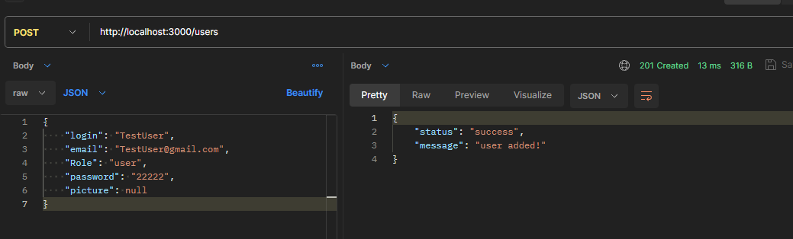
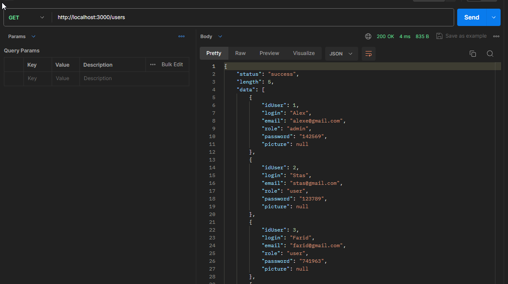
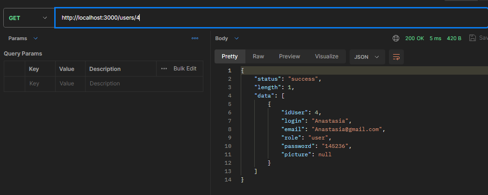
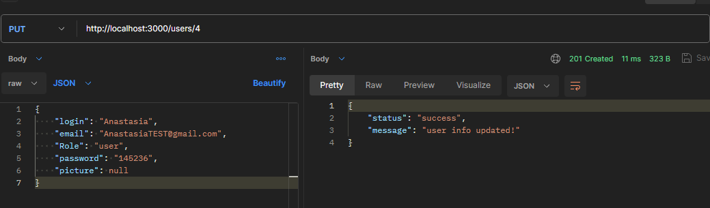
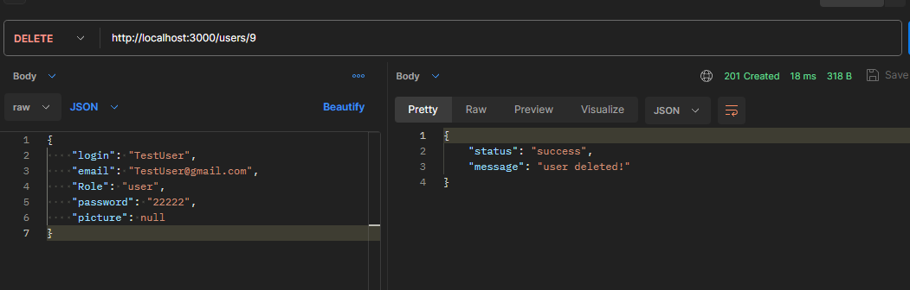

# Тестування працездатності системи

## Додавання користувача (POST)

## Виведення всіх користувачів (GET)

## Виведення користувача за id (GET)

## Оновлення даних користувача (UPDATE)

## Видалення користувача (DELETE)

